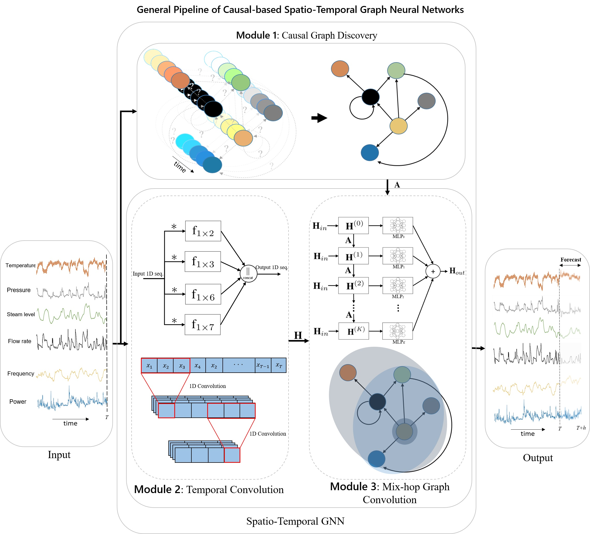

# CSTGNN
 Causal-based Spatio-Temporal Graph Neural  Networks for Industrial Internet of Things  Multivariate Time Series Forecasting


# **Causal-Based Spatio-Temporal Graph Neural Networks for Industrial IoT Multivariate Time Series Forecasting**



This repository contains the code for our paper:  
📄 **[Causal-Based Spatio-Temporal Graph Neural Networks for Industrial Internet of Things Multivariate Time Series Forecasting](https://doi.org/10.1007/978-3-031-44761-2_9)**  
✍ **Authors:** Amir Miraki, Austėja Dapkutė, Vytautas Šiožinys, Martynas Jonaitis & Reza Arghandeh  
📚 **Conference:** *Explainable Artificial Intelligence (xAI 2023), World Conference on Explainable AI*  
📖 **Book Series:** *Communications in Computer and Information Science (CCIS, Volume 1903)*  

In this work, we introduce a **framework** that enhances the efficiency of **spatio-temporal graph neural networks (GNNs)** for **Industrial IoT (IIoT) multivariate time series forecasting** by integrating **causality-based learning**.  

Our approach improves **model interpretability** by discovering **hidden relationships** between sensors, ensuring that deep learning decisions in **industrial time series forecasting** are both **accurate and explainable**. This is particularly crucial for **predictive maintenance, anomaly detection, and process optimization** in industrial settings.

<p align="center">
  
</p>

---

## **📌 Key Features**
✔ **Causal-Based Learning:** Incorporates a **causality graph** to uncover hidden sensor relationships.  
✔ **Spatio-Temporal Graph Neural Networks:** Integrates **graph-based spatial modeling** with **temporal convolution** for improved forecasting.  
✔ **Explainability:** Enhances interpretability by leveraging **causal inference** in spatio-temporal forecasting.  
✔ **Industrial Applications:** Predictive maintenance, anomaly detection, and operational efficiency in **Industrial IoT systems**.  

---

## **📂 Dataset**
Our experiments use **real-world industrial datasets**, including sensor-based time series data from **Industrial IoT applications**.   

Example dataset structure:
<p align="center">
  
</p>

---

## **🧠 Model Architecture**
Our framework consists of three main modules:

- **Causality Graph Module:** Discovers hidden relationships between sensors using causal inference.
- **Temporal Convolution Module:** Captures temporal dependencies in multivariate time series data.
- **Graph Neural Network Module:** Models spatial dependencies between sensors using graph neural networks.

<p align="center">
  
</p>

---

## **🔍 Explainability**
To ensure **model interpretability**, we integrate **causal inference techniques** to provide **insights into feature importance and sensor dependencies** in the forecasting process.  

---

## **📌 Acknowledgements**
- We utilize **graph neural networks (GNNs)** for spatial modeling.
- Causal inference is integrated using **data-driven causality learning methods**.
- The **datasets** used in this study originate from real-world **Industrial IoT systems**.

---

## **📬 Contact**
For questions or collaborations, feel free to open an issue or reach out!  

📧 Email: [amir.miraki@example.com](mailto:amir.miraki@example.com)  

---

## **📝 Citation**
If you find this work useful, please cite our paper:

```bibtex
@inproceedings{miraki2023causal,
  title={Causal-Based Spatio-Temporal Graph Neural Networks for Industrial Internet of Things Multivariate Time Series Forecasting},
  author={Miraki, Amir and Dapkutė, Austėja and Šiožinys, Vytautas and Jonaitis, Martynas and Arghandeh, Reza},
  booktitle={Explainable Artificial Intelligence},
  pages={120--130},
  year={2023},
  publisher={Springer}
}
```

